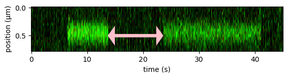

<h1>Effective kon from a kymograph</h1> 
<b>Author</b>: Aafke van den Berg 
<b>Research subjects</b>: DNA-binding proteins 
 

This Notebook contains a full example analysis workflow for determining the effective on-rate, k'on (the inverse of the binding time in Figure 1) for proteins binding to a target site. The on-rate is determined by tracking the duration of binding events of a fluorescently labeled protein on a kymograph, and determining the intervals between the binding events. The intervals are then collected and fitted to an exponential distribution to determine k'on .
 
</em>

 

<figure style="margin: 0px;"></figure>

<em>Figure 1: The effective on-rate can be determined from a kymograph by looking at the time intervals between binding events at a target binding site.</em>

 

<em>
 
