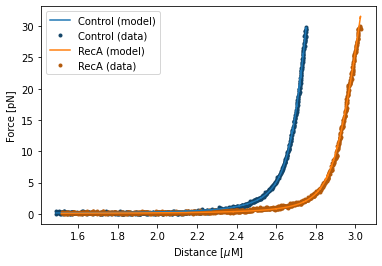
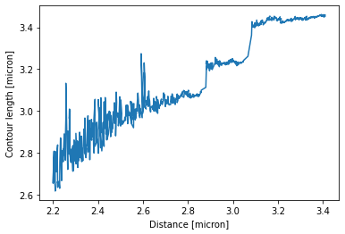

<h1>Extensible worm-like chain fitting with and without RecA</h1> 
<b>Author</b>: Joep Vanlier 
<b>Key words</b>: RecA, FD Fitting, WLC, pylake, DNA 
<b>Research subjects</b>: DNA-binding proteins 
 

RecA is a protein that is involved in DNA repair. In this notebook, we analyze data acquired in the presence and absence of RecA. RecA forms nucleoprotein filaments on DNA and is able to mechanically modify the DNA structure. Here, we quantify these changes using the worm-like chain model.

We demonstrate how to fit worm-like chain models, and invert them for contour length.

 

<figure style="margin: 0px;"></figure>

<em>Model fits in the presence and absence of RecA.</em>

<em> </em>

<figure style="margin: 0px;"></figure>

​<em>Per datapoint contour lengths assuming fixed persistence length and stretch modulus.</em>​

 

​<em>Note: This notebook depends on Pylake &gt;= 0.13.2. For more information and installation instructions, please see the documentation https://lumicks-pylake.readthedocs.io/en/stable/</em>​

 

 <strong>References</strong>

Broekmans, O. D., King, G. A., Stephens, G. J., &amp; Wuite, G. J. (2016). DNA twist stability changes with magnesium (2+) concentration.&nbsp;<em>Physical review letters</em>,&nbsp;<em>116</em>(25), 258102.

Odijk, T. (1995). Stiff chains and filaments under tension.&nbsp;<em>Macromolecules</em>,&nbsp;<em>28</em>(20), 7016-7018.

Wang, M. D., Yin, H., Landick, R., Gelles, J., &amp; Block, S. M. (1997). Stretching DNA with optical tweezers.&nbsp;<em>Biophysical journal</em>,&nbsp;<em>72</em>(3), 1335.
  
 

