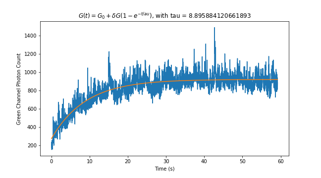

<h1>Fluorescence Recovery After Photobleaching (FRAP) Fitting</h1> 
<b>Author</b>: Joep Vanlier 
<b>Key words</b>: Fitting, FRAP 
<b>Research subjects</b>: Phase separation 
 

This notebook demonstrates how to do some basic curve fitting to FRAP data acquired with bluelake. In a typical FRAP experiment a selected region will be photobleached by an intense laser pulse. After bleaching, the fluorescence will typically recover. The recovery of this intensity contains information on the influx of molecules that have not been photobleached.

In this notebook, we are dealing with protein droplets. We subsequently photobleach these droplets by using an intense laser pulse. After this initial bleaching phase, the laser is returned to a low power and we can observe the photobleached proteins in the droplets exchange with the fluorescent proteins. 

 

<figure style="margin: 0px;"></figure>

 <em>Figure: Fluorescence recovery after photobleaching</em>

<em> </em>

<em>Note: This notebook depends on Pylake. For more information and installation instructions, please see the documentation https://lumicks-pylake.readthedocs.io/en/stable/</em> 
  
 

