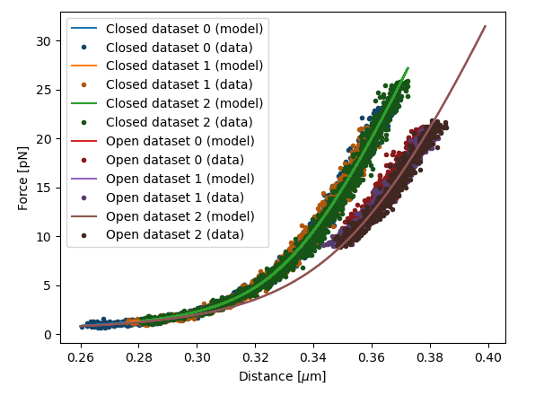

<h1>Worm-like chain fitting protein unfolding data: AdK</h1> 
<b>Author</b>: Joep Vanlier 
<b>Key words</b>: FD, Protein contour length, FD Fitting, WLC, Fitting, pylake 
<b>Research subjects</b>: Protein folding 
 

In this notebook, we fit force-extension (force-distance) curves (F,d curves) of a protein attached to beads using DNA handles. Additionally, we will demonstrate how to extract the contour length change due to unfolding event. 

 

<figure style="margin: 0px;"></figure>

<em>Figure: Data selection widget.</em>

 

<figure style="margin: 0px;"></figure>

<em>Figure: Fitted composite worm-like chain model comprising of a DNA linker and protein.</em> 

 <em>Note: This notebook depends on Pylake &gt;= 0.13.2</em>

<em> </em>

<em> </em><strong>Changelog</strong>

Version 2: Added sentence to clarify that slicing is done by time.

 

​<strong>References</strong>

 

​[1] Broekmans, O. D., King, G. A., Stephens, G. J., &amp; Wuite, G. J. (2016). DNA twist stability changes with magnesium (2+) concentration. Physical review letters, 116(25), 258102.

​[2] Jahn, M., Buchner, J., Hugel, T., &amp; Rief, M. (2016). Folding and assembly of the large molecular machine Hsp90 studied in single-molecule experiments. Proceedings of the National Academy of Sciences, 113(5), 1232-1237. 
  
 

