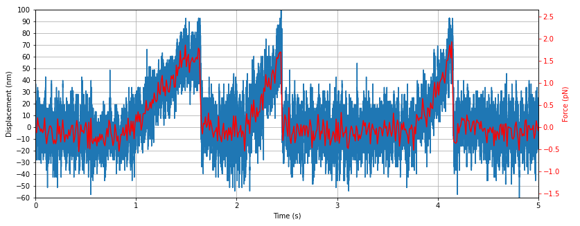
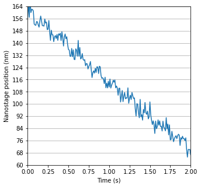

<h1>Analyzing the motion of kinesin-1 motors on microtubules</h1> 
<b>Author</b>: Joep Vanlier 
<b>Key words</b>: motors, microtubules, motion, kinesin, pylake, CST 
<b>Research subjects</b>: Cytoskeletal structure and transport 
 

These are two notebooks where we study the motion of kinesin-1 motors on microtubules.

 

In the experiments analyzed, we had microtubules on the surface. We trapped beads coated with kinesin motors in the presence of ATP and lowered to the surface to make contact with a microtubule. Then, we waited until the motor attached to the microtubule and started moving.

 

There are two notebooks in the zip file along with sample data. In these notebooks we analyze the movement of the kinesins in two ways. First, without feedback, where the bead is pulled out of the center of the trap as the kinesin moves, thereby increasing the force on the bead. Second, with the force feedback on, which keeps the connection between the motor and the microtubule at a given constant force. In this latter configuration, every step that the kinesin takes needs to be compensated by the same amount of movement of the nanostage, thereby enabling the tracking of the motor one step at a time.

 

<figure style="margin: 0px;"></figure>

<em>Figure 1: Force generated from Kinesin stepping on a microtubule.</em>

 

<figure style="margin: 0px;"></figure>

<em>Figure 2: Nanostage displacement over time, which mimics the stepping behavior of the kinesin.</em>

 

<em style="font-size: 13px;">Note: This notebook depends on Pylake. For more information and installation instructions, please see the documentation https://lumicks-pylake.readthedocs.io/en/stable/</em> 
  
 

