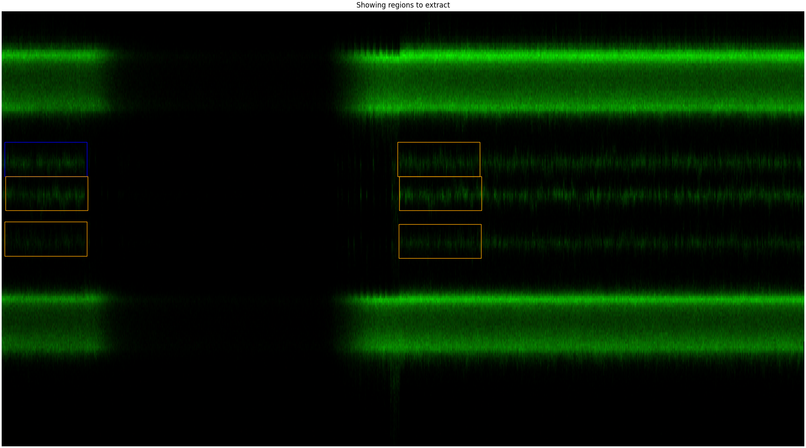
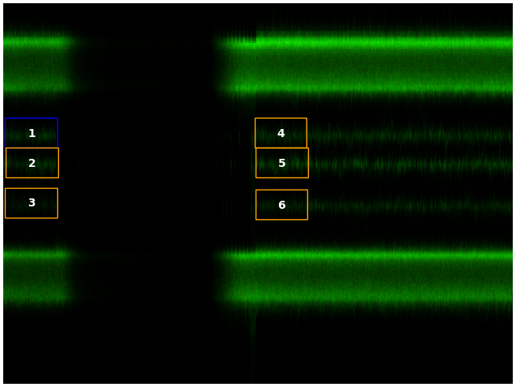
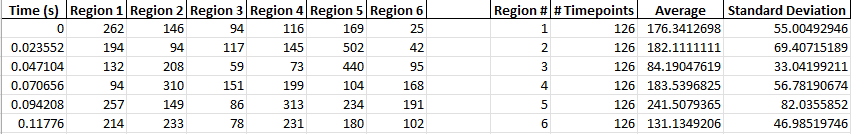
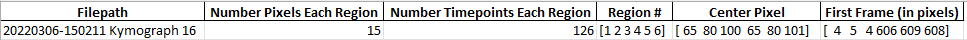

<h1>Area Photon Count Extractor</h1> 
<b>Author</b>: John Watters 
<b>Key words</b>: fluorescence 
<b>Research subjects</b>: DNA-binding proteins, Other applications 
 

This script is used to extract the sum of photon counts in a line scan from chosen areas of a kymograph in a .h5 file. This analysis method is useful when you want to measure raw intensity values of fluorescent molecules to quantify how many molecules are present without worrying about potential biases introduced by using line tracking methods.

You can download the script <a href="https://github.com/watters16j/CTrap-Scripts">here</a>.

&nbsp;

The user will be asked via text inputs to navigate to the .h5 file of interest and apply a multiplier value to photon counts if desired (for display purposes only monitoring the method used in CTrapVis.py). The user will then choose how they want to define the area to analyze either by [1] Explicitly defined dimensions or [2] dragging a window on the kymograph in a pop-up window. Then the user will be asked to click on other regions to extract where the click defines the center-left point of the box (in the cartoon below,&nbsp; '-' is the number of time points being analyzed, '|' is the number of pixels being analyzed, and 'X' marks the spot where the user clicks).

&nbsp;

--------------

|&nbsp; &nbsp; &nbsp;&nbsp; &nbsp; &nbsp; &nbsp; &nbsp;|

|&nbsp; &nbsp; &nbsp;&nbsp; &nbsp; &nbsp; &nbsp; &nbsp;|

X&nbsp; &nbsp; &nbsp;&nbsp; &nbsp; &nbsp; &nbsp; |

|&nbsp; &nbsp; &nbsp;&nbsp; &nbsp; &nbsp; &nbsp; &nbsp;|

|&nbsp; &nbsp; &nbsp;&nbsp; &nbsp; &nbsp; &nbsp; &nbsp;|

--------------

&nbsp;

Once the points are selected on the plot, then you can exit the plot. This will show you a separate image showing the regions the script will extract. If you used the&nbsp;'dragging a kymograph window' method of defining the area dimensions, then you will see the original box drawn in blue with the additionally clicked boxes drawn in orange.

 

<figure style="margin: 0px;"></figure>

 

If the user is happy with the point selection, they can confirm that through user input and the script will be extracted the data to a .xlsx file. There are two types of sheets in the output .xlsx. The first sheet-type shows the sum of the columns of each region (at each time point) and the extracted simple statistics from each region (average and standard deviation) for each channel you want to extract.The second sheet-type records some metadata that might be useful if you need to remake any plots/redo any analysis. In addition, an image of the extracted regions is also outputted as a .png for a quick resource on which region #'s align with other regions of the plot.

<u>Example .png output</u>

 

<figure style="margin: 0px;"></figure>

<u>Example .xlsx output</u>

Example Photon Count Data

<figure style="margin: 0px;"></figure>

Example Metadata

<figure style="margin: 0px;"></figure>

 

<strong><u>Version Information:</u></strong>
<ul type="disc"> <li>Lumicks.pylake - 0.8.1</li><li>pandas - 1.4.1</li><li>matplotlib - 3.5.1</li><li>numpy - 1.22.3</li></ul>
Enjoy!

&nbsp;
  
<b>If you like this script, please cite me</b>: 
Watters, J.W. (2022) Area Photon Count Extractor. Retrieved from https://harbor.lumicks.com/ 
 
 

