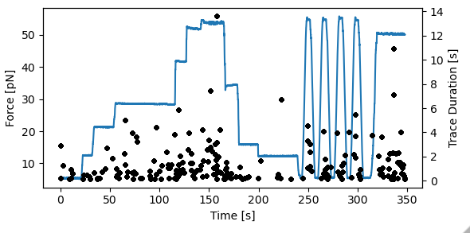

<h1>Studying Cas9 binding to DNA using the kymotracker</h1> 
<b>Author</b>: Joep Vanlier 
<b>Key words</b>: cas9, DNA, kymotracking 
<b>Research subjects</b>: DNA-binding proteins 
 

This notebook demonstrates some of the new kymotracking features available in Pylake. 

As an example case study, we will use some measurements of Cas9 binding to DNA obtained while stretching the DNA tether at different forces. In the notebook, we quantify the binding events obtained during the experiment.

 

<figure style="margin: 0px;"></figure>

<em>Figure 1: Kymotracker widget in action.</em>

 

<figure style="margin: 0px;"></figure>

<em>Figure 2: Binding events versus Force.</em>

 

<em>Note that this notebook depends on Pylake v1.0.0, For more information on how to install Pylake see:</em>

<a href="https://lumicks-pylake.readthedocs.io/en/stable/install.html"><em>https://lumicks-pylake.readthedocs.io/en/stable/install.html</em></a>

 

<strong>References</strong>

[1] Sbalzarini, I. F., &amp; Koumoutsakos, P. (2005). Feature point tracking and trajectory analysis for video imaging in cell biology. Journal of structural biology, 151(2), 182-195.

[2] Mangeol, P., Prevo, B., &amp; Peterman, E. J. (2016). KymographClear and KymographDirect: two tools for the automated quantitative analysis of molecular and cellular dynamics using kymographs. Molecular biology of the cell, 27(12), 1948-1957.

[3] Steger, C. (1998). An unbiased detector of curvilinear structures. IEEE Transactions on pattern analysis and machine intelligence, 20(2), 113-125.
  
 

