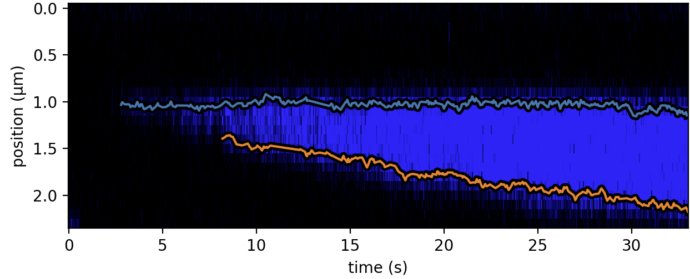

<h1>Edge detection on a kymograph</h1> 
<b>Author</b>: Aafke van den Berg 
<b>Key words</b>: edge detection, fluorescence, pylake, kymograph, DNA 
<b>Research subjects</b>: DNA-binding proteins 
 

This Notebook illustrates how to use the Kymotracker in Pylake to detect edges on a kymograph.&nbsp;

<figure style="margin: 0px;"></figure>
  
 

