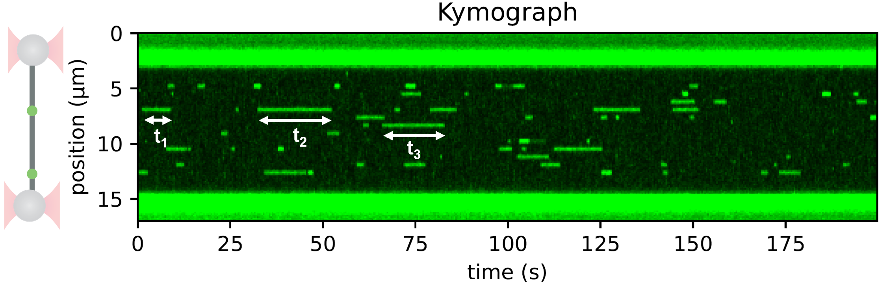

<h1>Protein binding lifetime from kymograph</h1> 
<b>Author</b>: Aafke van den Berg 
<b>Research subjects</b>: DNA-binding proteins 
 

This Notebook contains a full example analysis workflow for determining the duration of binding of a protein to DNA. The binding lifetime is determined by tracking the duration of binding events of a fluorescently labeled protein on a kymograph, as illustrated in the figure below. The durations are then collected and fitted to an exponential distribution to determine the binding lifetime.
 
</em>

 

<figure style="margin: 0px;"></figure>

<em>Figure 1: The duration of binding can be determined from a kymograph by looking at the length of a binding event.</em>

 

<em>
 
