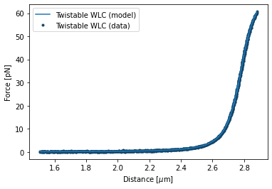

<h1>Twistable worm-like chain model fitting</h1> 
<b>Author</b>: Joep Vanlier 
<b>Key words</b>: WLC, DNA, Overstretching, FD Fitting 
<b>Research subjects</b>: DNA-binding proteins 
 

In this notebook, we analyze force extension data of DNA over its full range of structural transitions under mechanical stress (0 - 60 pN). The twistable worm-like chain model (tWLC) takes twisting deformations on the DNA double helix into account. Here we will use this model to describe the mechanical response of DNA at such high forces.

 

<figure style="margin: 0px;"></figure>

<em>Figure: The twistable worm-like chain fitted to some data.</em>

<em> </em>

<em>Note: This notebook depends on Pylake &gt;= 0.13.2. For more information and installation instructions, please see the documentation https://lumicks-pylake.readthedocs.io/en/stable/</em>

<em> </em>

<strong>References</strong> 

Gross, P., Laurens, N., Oddershede, L. B., Bockelmann, U., Peterman, E. J., &amp; Wuite, G. J. (2011). Quantifying how DNA stretches, melts and changes twist under tension.&nbsp;<em>Nature Physics</em>,&nbsp;<em>7</em>(9), 731-736.

Broekmans, O. D., King, G. A., Stephens, G. J., &amp; Wuite, G. J. (2016). DNA twist stability changes with magnesium (2+) concentration.&nbsp;<em>Physical review letters</em>,&nbsp;<em>116</em>(25), 258102.

Odijk, T. (1995). Stiff chains and filaments under tension.&nbsp;<em>Macromolecules</em>,&nbsp;<em>28</em>(20), 7016-7018.
  
 

