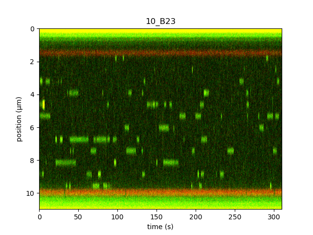

<h1>Automation script for reference kit</h1> 
<b>Author</b>: Maartje Pontier, Aafke van den Berg 
<b>Key words</b>: kymograph, fluorescence, reference kit 
<b>Research subjects</b>: DNA-binding proteins 
 

This script automates the workflow for the LacI reference kit. 

The script follows the following steps:  

1) Catch beads 2) Catch a DNA tether 3) Check if it is only a single tether, if not, try to break tethers until there is 1 left. 4) Move microstage to protein channel   5) Stretch the tether to a force of 10 pN 6) Start a kymograph  7) Stop the kymograph   9) Repeat steps 1 to 7 
 

The script has been tested rigourously, but may need be optimized for your system.
Parameters that you, for example, may have to optimize are: the pressure of the microfluidics for obtaining optimal flow, the names of the channels in the flowcell and the number of kymographs that you want to record.
 
</em>

 

<figure style="margin: 0px;"></figure>

<em>Figure 1: Kymograph recorded using the LacI reference kit.</em>

 

<em>
 
