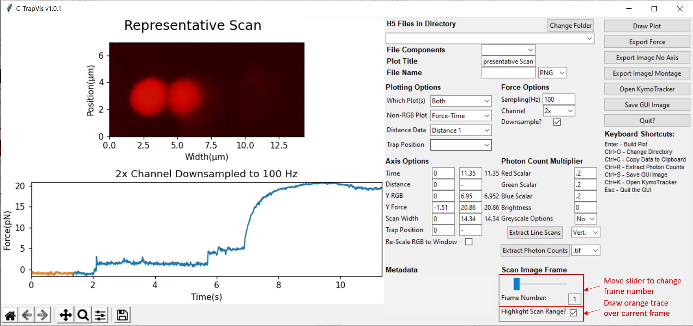

<h1>C-Trap .h5 File Visualization GUI</h1> 
<b>Author</b>: John Watters 
<b>Key words</b>: pylake, fluorescence, Visualization 
<b>Research subjects</b>: Other applications 
 

This script is the second version of a GUI designed to dynamically look through .h5 files from a Lumicks C-Trap instrument and to extract desired data for further analysis. This script allows users to take full advantage of the tools in the pylake library to visualize and extract data of interest without python scripting knowledge or the need for a computer with blue lake software.

You can download the script <a href="https://github.com/watters16j/CTrap-Scripts">here</a>.

Users are able to choose what plots they want(Trap Position vs. Time, Force vs. Distance, Force vs. Time, RGB image, or a combination of RGB and one of the force/trap position options) with options to customize the plot to add a title, scale RGB image values, shift the axis of all available axis. This script can analyze kymograph, scans/multiple scans, and force-distance curves contained within a .h5 file

&nbsp;

Comparable axes are linked by the manual entries, but the individual plots can be zoomed in/out of using the interactive toolbar. The save name for both the image and the metadata files can be customized by the "File Name to Save" entry and the "Image Format" option for the “Save GUI Image” function. The"Draw Plot" button pulls in all of the GUI information and draws/plots the correct plot back on the interface. The "Quit" button destroyed the Tkinter GUI and quits the python execution. The "ExportForce" button pulls a separate Tkinter window to allow the user to export desired force data to a .csv file for further analysis. The "Export ImageNo Axis" button exports the scan image without axis/extra space being plotted in the GUI window as .png files. The "Export ImageJ Montage" button exports can image in such a way that the axis are shown as well as a timestamp of the image for easy transformation into an ImageJ montage. The "Save GUI Image" re-draws the plot and takes a screenshot of the GUI image and saves it as a file type and name inputted in the "File Name" selection. The"Open KymoTracker" button opens a new window used to track lines and extract data using the algorithms in the pylake library.

&nbsp;

​<strong>Python Modules Used:&nbsp;</strong>numpy,lumicks.pylake, matplotlib, tkinter, pandas, glob, os, tifffile (new to version 3)
<ul><li>Requires lumicks.pylake version to be at least 0.8.1 for version 3 onwards (new to version 3)</li></ul>
<strong> </strong>

<strong>To Run:</strong>
<ol type="1"><li>Download the CTrapVis.py script and put it in a folder.</li><li>Open up terminal and change the working directory to the folder containing the correct script.</li><li>Type the command "python CTrapVis.py" and hit     enter</li><li>After a few seconds, the GUI interface should show up     (Note: this may look different on a Mac because tkinter widgets match the     OS)</li>
<figure style="margin: 0px; width: 372px;"></figure>
<li>Hit the change folder button and navigate to the folder containing the .h5 files that you want to visualize.</li><li>Choose the file in the "H5 Files in     Directory" pulldown menu, as well as the specific object in the .h5     file to visualize by changing the option in the "File     Components" pulldown menu.</li><li>Other parameters in the Plotting Options, Force     Options, or the Photon Count Multipliers can be changed before hitting the     "Draw Plot" button to draw the desired plot on the canvas to the     left of the options panel (see example Outputs of GUI For Different Data     Objects)</li><li>Save desired data/image using the export/save buttons     on the right of the GUI</li></ol>
&nbsp;

<strong>Labeled Example Outputs of GUI For Different Data Objects:</strong>

File name and metadata are redacted from these example outputs at the individual's request.

<strong><u>Kymograph</u></strong>

<figure style="margin: 0px;"></figure>

<strong><u>KymoTracker – Separate Window Pop Out</u></strong> 
<ul><li>Define an area by either dragging a single rectangle on the drawn plot / define a custom region of interest using the “Define Region of Interest" </li></ul>
<figure style="margin: 0px;"></figure>

<strong><u>Scan</u></strong>

<figure style="margin: 0px;"></figure>

<strong><u>Fdcurve</u></strong>

<figure style="margin: 0px;"></figure>

&nbsp;

<strong>Notes of Potential Interest:</strong>
<ul type="disc"> <li>"Both" force channel data outputs the     magnitude of the force on the bead</li><li>Force 2x data if automatically inverted - because that     is standard practice for the Liu lab</li><ul type="circle">  <li>To remove this, search for the text "if      forceString == '2x':" and delete the contents of that if statement</li></ul><li>When you change files, the program might freeze for a     few seconds – it is accessing/storing the RGB data for quicker access when     you call the plotting options</li><li>Export ImageJ Montage button is suited for droplet     fusion/FRAP experiments where you want to export similar images with both     time and position data&nbsp;</li><ul type="circle">  <li>Doesn't apply any additional functionality for      kymograph objects/just scan objects with multiple frames</li></ul><li>For scans with multiple frames - the scan image frame     slider will become active and let you toggle through the images. The     highlight scan option will add an additional trace covering the range of     the force regime that is represented at the same time the current scan     image was taken.</li><li>If the GUI window is too large for your screen you can     change this by lowering the .set_dpi() parameter from 110 until it doesn't     exceed your screen limits (search for     "figureReturned.set_dpi(110)")</li><li>Images are being reconstructed by directly relating     photon count (for each pixel for each color) to an RGB value (after     multiplying by the photon count multiplier value and adding the brightness     addition value</li><li>Typo in the previous version had a typo regarding pixel threshold in the KymoTracking application - fixed in current version</li></ul>
&nbsp;

<strong>Versions Tested In:</strong>
<ul type="disc"> <li>Python - 3.8.6</li><li>NumPy - 1.19.2</li><li>lumicks.pylake - 0.8.1</li><li>Matplotlib - 3.3.2</li><li>pandas - 1.1.2</li><li>tifffile - 2020.10.1            </li></ul>
<strong>Authors:&nbsp;</strong>John Watters
<ul><li>Force Export Button functionality comes from unpublished code written by Dr. Michael Wasserman</li></ul>

<b>If you like this script, please cite me</b>: 
Watters, J.W. (2020) C-Trap .h5 Visualization GUI. Retrieved from https://harbor.lumicks.com/
 
 

